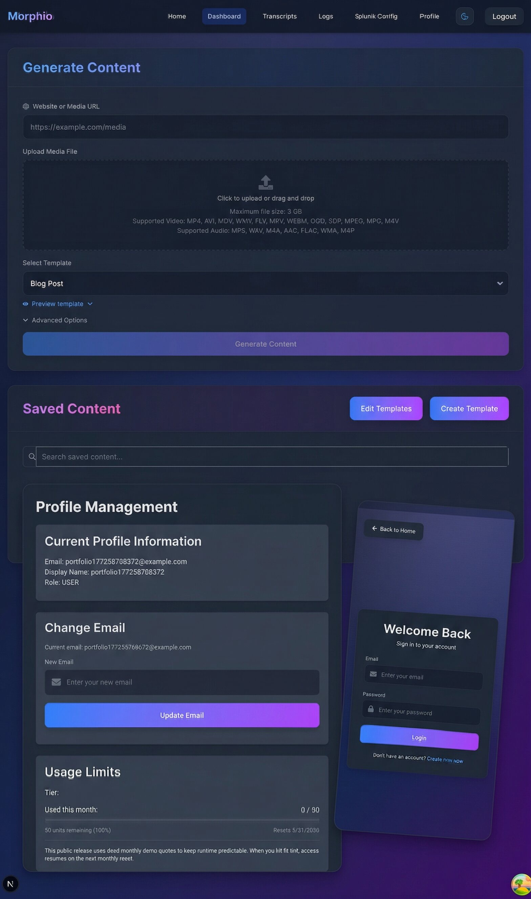

# Morphio Monorepo

<p align="center">
  
</p>

Morphio is a monorepo for AI-assisted content workflows. The main application is `morphio-io`, a FastAPI + Next.js system for turning media, web, and log inputs into structured outputs. The repo also includes `morphio-core`, which extracts reusable media, LLM, and security logic behind a strict adapter boundary, plus `morphio-native` for performance-sensitive native routines.

## Overview

If you want the fastest path to understanding the project:

1. Read the [Architecture Overview](./docs/architecture-overview.md).
2. Start with [`morphio-io/`](./morphio-io/) as the primary application surface.
3. Use [`morphio-core/`](./morphio-core/) to inspect the reusable library boundary.
4. Run:

```bash
make env
make install
make ci-fast
make ci
```

## Projects

| Project | Description | Path |
|---------|-------------|------|
| **morphio-io** | Full-stack web application (FastAPI + Next.js) | `morphio-io/` |
| **morphio-core** | Standalone Python library for audio/LLM/security utilities | `morphio-core/` |
| **morphio-native** | Native binaries and accelerators | `morphio-native/` |

## Documentation

- [Architecture Overview](./docs/architecture-overview.md) - system boundary and trade-offs
- [Validation Commands](./docs/validation-commands.md) - local checks matching CI
- [Verification Checklist](./docs/verification-checklist.md) - short validation path from a fresh clone
- [Release Readiness Report](./docs/release-readiness-report.md) - hardening work and receipts
- [Configuration Guide](./docs/configuration.md) - environment and runtime configuration
- [Troubleshooting](./docs/troubleshooting.md) - common setup and CI fixes
- [Shared Docs Index](./docs/) - the rest of the cross-cutting documentation
- [Contributing](./CONTRIBUTING.md), [Security Policy](./SECURITY.md), [Code of Conduct](./CODE_OF_CONDUCT.md)

## Quick Start

```bash
make env
make install            # baseline, public-safe dependency footprint
make ci-fast
make ci
make dev
```

## Visual Tour

<p align="center">
  
</p>

These visuals are based on the live application UI and current runtime screenshots, then compressed for README use.

- `morphio-io` is the primary application surface: content generation, profile management, templates, logs, transcripts, and admin tooling.
- `morphio-core` is where the reusable AI/media/security integration logic lives.
- `morphio-native` provides focused native acceleration for performance-sensitive paths.

## Project Relationship

morphio-core is a standalone library extracted from morphio-io. The web app uses it via **uv workspace dependency**:

```
morphio-io/backend
    |
    +-- app/adapters/       # Thin wrappers that translate exceptions
    |       audio.py        # Uses morphio_core.audio
    |       video.py        # Uses morphio_core.video
    |       url_validation.py  # Uses morphio_core.security
    |
    +-- pyproject.toml      # Has morphio-core as path dependency
            |
            v
morphio-core/
    +-- src/morphio_core/
            security/       # URLValidator, Anonymizer, SSRF protection
            audio/          # Chunking, transcription, speaker alignment
            llm/            # Multi-provider router (OpenAI, Anthropic, Gemini)
            video/          # YouTube URL parsing, yt-dlp download
            media/          # FFmpeg utilities
```

## Commands

### Root Commands (from monorepo root)

| Command | Description |
|---------|-------------|
| `make env` | Create/refresh root `.env` with strong local secrets |
| `make install` | Install baseline dependencies (safe default) |
| `make install-full` | Install all optional heavy dependency groups/extras |
| `make install-ml` | Install backend ML dependency group (heavy opt-in) |
| `make dev` | Start morphio-io dev servers |
| `make ci-fast` | Fast local checks (same scope as PR gate) |
| `make ci` | Full local CI gate (required before commits) |
| `make test` | Run all tests (morphio-core + morphio-io) |
| `make lint` | Lint everything |
| `make clean` | Clean all build artifacts |

### morphio-io Commands (from `morphio-io/`)

| Command | Description |
|---------|-------------|
| `make dev` | Start backend + frontend |
| `make ci` | Full CI gate (required for PRs) |
| `make test` | Run backend + frontend tests |
| `make dev-docker` | Run everything in Docker |

See `morphio-io/README.md` for full documentation.

### morphio-core Commands (from `morphio-core/`)

| Command | Description |
|---------|-------------|
| `uv run pytest` | Run all 133 tests |
| `uv run ruff check .` | Lint |
| `uv run ruff format .` | Format |

See `morphio-core/README.md` for full documentation.

## Development Workflow

### Working on morphio-io

```bash
make dev          # Start dev servers (repo root)
make ci           # Run local CI gate before committing
```

### Working on morphio-core

```bash
cd morphio-core
uv run pytest     # Run tests
uv run ruff check # Lint
```

### Cross-Project Changes

When modifying morphio-core APIs that morphio-io uses:

1. Update morphio-core
2. Run morphio-core tests: `cd morphio-core && uv run pytest`
3. Update morphio-io adapters if needed
4. Run local CI gate: `make ci`

## Architecture

### Why Separate Library?

- **Reusability**: morphio-core can be used in other projects
- **Clean separation**: No HTTP/web dependencies in core logic
- **Easier testing**: Library can be tested in isolation
- **Explicit boundaries**: Adapters translate between library and app concerns

### Adapter Pattern

morphio-io uses thin adapters (`app/adapters/`) that:
- Import from morphio-core
- Translate library exceptions to HTTP exceptions (ApplicationException)
- Keep the boundary clear between library and application concerns

## Tech Stack

### morphio-io
- **Backend**: Python 3.14+, FastAPI, SQLAlchemy, PostgreSQL, Redis
- **Frontend**: Next.js 16.1.6, React 19.2.4, TypeScript, TailwindCSS 4
- **Node.js**: ≥25.0.0
- **Ports**: Backend 8005, Frontend 3005 (Docker 3500→3005), Redis 6384
- **DevOps**: Docker, local CI via `make ci`

### morphio-core
- **Language**: Python 3.14+
- **Audio**: FFmpeg, Whisper (MLX/faster-whisper)
- **LLM**: OpenAI, Anthropic, Gemini SDKs
- **Video**: yt-dlp
- **Security**: URL validation, content anonymization

## Contributing

1. Create a feature branch
2. Make changes
3. Run `bash scripts/install-git-hooks.sh` once
4. Run `make ci-fast` while iterating, then `make ci` before PR
5. Create a Pull Request

For bugs or feature requests, open an issue using the repository templates.

## License

MIT (see [LICENSE](./LICENSE)).
